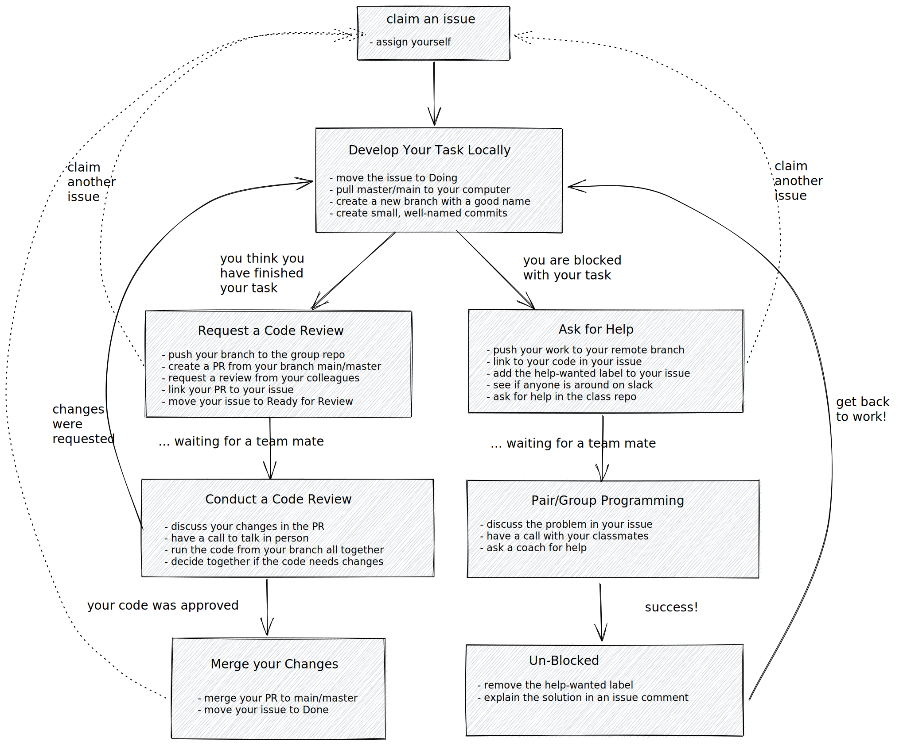

## 6. Development

Everything is planned, the board is ready, it's time to get started. As you develope your project, you will keep track of everything on the project board. You can leave your Development Strategy aside until the retrospective.

## `help-wanted` Label

Add this label to your issue when you're blocked. Your team mates will be able to see this on the project board or by filtering all the project issues.

## Opening New Issues

Issues are flexible, you can always create new issues or update existing ones after the project has started. Up to now you have created issues for planned tasks, but issues can be used for all sorts of tasks. Especially tasks that you weren't able to plan for.

Some common reasons to create new issues:

- **Bugs**: if you find a _bug_ in the `master`/`main` branch you can open a new issue, describe the problem, and attach the `bug` label. Someone can claim the issue, fix the bug on a new branch, and open a PR.
- **Enhancements**: if you have an idea to improve code that _already exists_ in the `main`/`master` branch you can open a new issue, describe the changes you have in mind, and add the `enhancement` label. If some has time they can claim this issue, develop the enhancement on a new branch, and send a PR.
- **Discussion**: is something not clear about the project? Maybe your Strategy wasn't correct and you need to make some changes to the plan? Open a new issue, add the `discussion` label, and assign your team mates. Discussion issues probably won't have a linked PR. You can move them to _Done_ and close them when your team has come to a decision.
- **Super Speedy**: if you have finished all of your milestones, don't stop! Return to your backlog and choose another User Story to develop. Add a new milestone, create new issues and keep on coding.

## Claim, Branch, Review, Merge

This is it, the real deal. Finally you can write some code!

You and your team mates will each work on one issue at a time, asking for help and tracking your progress using the project board. You will be responsible for writing your code on a new branch, and your team mates will be responsible for reviewing and merging your code to main/master.

It will take a little while to get used to this workflow, but once you do there's no going back!

[(flowchart source)](https://excalidraw.com/#json=6008567970660352,p5ugekwrYMsnZmyBsOF92Q)

